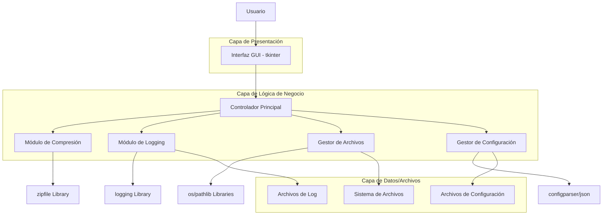
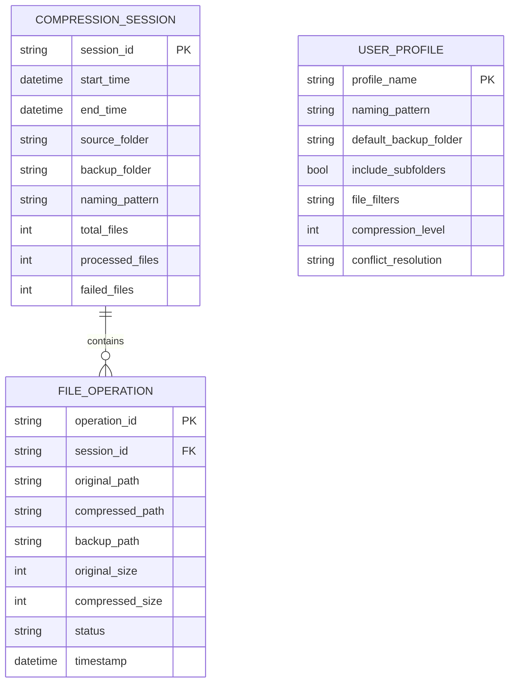

# Documento de Arquitectura Técnica - Automatización de Compresión de Archivos

## 1. Diseño de Arquitectura



## 2. Descripción de Tecnologías

* **Frontend**: Python 3.8+ con tkinter para interfaz gráfica

* **Backend**: Lógica de aplicación en Python puro

* **Librerías principales**: zipfile, logging, pathlib, configparser, threading

* **Librerías adicionales**: ttkthemes (para estilos modernos), pillow (para iconos)

## 3. Definiciones de Rutas

| Ruta/Módulo              | Propósito                                                   |
| ------------------------ | ----------------------------------------------------------- |
| main.py                  | Punto de entrada principal, inicialización de la aplicación |
| gui/main\_window\.py     | Ventana principal con pestañas y controles principales      |
| gui/config\_window\.py   | Ventana de configuración avanzada                           |
| gui/progress\_window\.py | Ventana de monitoreo de progreso y logging                  |
| core/compressor.py       | Lógica principal de compresión de archivos                  |
| core/file\_manager.py    | Gestión de archivos, movimiento a respaldo                  |
| core/logger.py           | Sistema de logging personalizado                            |
| core/config\_manager.py  | Gestión de configuraciones y perfiles                       |
| utils/validators.py      | Validaciones de entrada y archivos                          |
| utils/helpers.py         | Funciones auxiliares y utilidades                           |

## 4. Definiciones de API Interna

### 4.1 API Principal del Compresor

**Clase CompressorEngine**

```python
class CompressorEngine:
    def compress_files(self, config: CompressionConfig) -> CompressionResult
```

Parámetros de entrada:

| Nombre del Parámetro | Tipo | Requerido | Descripción                    |
| -------------------- | ---- | --------- | ------------------------------ |
| source\_folder       | str  | true      | Ruta de la carpeta origen      |
| backup\_folder       | str  | true      | Ruta de la carpeta de respaldo |
| naming\_pattern      | str  | true      | Patrón de nomenclatura         |
| include\_subfolders  | bool | false     | Procesar subcarpetas           |
| file\_filters        | list | false     | Filtros de tipo de archivo     |
| compression\_level   | int  | false     | Nivel de compresión (0-9)      |
| conflict\_resolution | str  | false     | Estrategia para conflictos     |

Respuesta:

| Nombre del Parámetro | Tipo  | Descripción                   |
| -------------------- | ----- | ----------------------------- |
| success              | bool  | Estado general del proceso    |
| processed\_files     | int   | Número de archivos procesados |
| failed\_files        | int   | Número de archivos fallidos   |
| total\_size\_saved   | int   | Espacio ahorrado en bytes     |
| execution\_time      | float | Tiempo total de ejecución     |
| errors               | list  | Lista de errores encontrados  |

### 4.2 API de Configuración

**Gestión de perfiles de usuario**

```python
class ConfigManager:
    def save_profile(self, profile_name: str, config: dict) -> bool
    def load_profile(self, profile_name: str) -> dict
    def list_profiles(self) -> list
```

### 4.3 API de Logging

**Sistema de logging personalizado**

```python
class CustomLogger:
    def log_operation(self, level: str, message: str, file_path: str = None)
    def get_session_stats(self) -> dict
```

## 5. Arquitectura del Servidor (No Aplicable)

Esta aplicación es completamente local y no requiere arquitectura de servidor.

## 6. Modelo de Datos

### 6.1 Definición del Modelo de Datos



### 6.2 Definición de Estructuras de Datos

**Archivo de Configuración (config.json)**

```json
{
  "profiles": {
    "default": {
      "naming_pattern": "fecha_archivo",
      "backup_folder": "./respaldo",
      "include_subfolders": false,
      "file_filters": ["*"],
      "compression_level": 6,
      "conflict_resolution": "rename"
    }
  },
  "app_settings": {
    "log_level": "INFO",
    "max_log_files": 30,
    "theme": "default"
  }
}
```

**Archivo de Log (logs/compression\_YYYY-MM-DD.log)**

```
[2024-01-15 14:30:15] INFO - Sesión iniciada: session_12345
[2024-01-15 14:30:16] INFO - Carpeta origen: C:\Documentos
[2024-01-15 14:30:17] SUCCESS - documento1.pdf → 2024-01-15_documento1.pdf.zip (Reducido 15%)
[2024-01-15 14:30:18] SUCCESS - imagen.jpg → 2024-01-15_imagen.jpg.zip (Reducido 5%)
[2024-01-15 14:30:19] ERROR - archivo_corrupto.docx: No se pudo leer el archivo
[2024-01-15 14:30:20] INFO - Archivos movidos a respaldo: 2/3
[2024-01-15 14:30:21] INFO - Sesión completada: 2 éxitos, 1 error
```

**Estructura de Directorios del Proyecto**

```
AutomatizacionFacturas/
├── main.py
├── requirements.txt
├── config.json
├── gui/
│   ├── __init__.py
│   ├── main_window.py
│   ├── config_window.py
│   └── progress_window.py
├── core/
│   ├── __init__.py
│   ├── compressor.py
│   ├── file_manager.py
│   ├── logger.py
│   └── config_manager.py
├── utils/
│   ├── __init__.py
│   ├── validators.py
│   └── helpers.py
├── logs/
│   └── compression_YYYY-MM-DD.log
├── assets/
│   └── icons/
└── tests/
    ├── test_compressor.py
    └── test_file_manager.py
```

