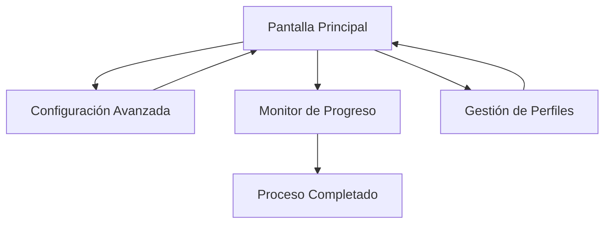

# Documento de Requerimientos del Producto - Automatización de Compresión de Archivos

## 1. Descripción General del Producto

Sistema de automatización para comprimir archivos individuales en formato ZIP con nomenclatura personalizable y gestión inteligente de archivos originales.

El producto resuelve la necesidad de procesar múltiples archivos de forma eficiente, permitiendo al usuario comprimir documentos con patrones de nomenclatura específicos y mantener un respaldo organizado de los archivos originales.

Objetivo: Automatizar el proceso de compresión de archivos para usuarios que manejan grandes volúmenes de documentos diariamente, reduciendo el tiempo de procesamiento manual en un 90%.

## 2. Características Principales

### 2.1 Roles de Usuario

| Rol | Método de Acceso | Permisos Principales |
|-----|------------------|----------------------|
| Usuario Final | Ejecución directa de la aplicación | Acceso completo a todas las funcionalidades de compresión y configuración |

### 2.2 Módulos de Funcionalidad

Nuestro sistema de automatización de compresión consta de las siguientes páginas principales:

1. **Pantalla Principal**: Selección de carpetas, configuración de opciones de compresión, inicio del proceso.
2. **Configuración Avanzada**: Patrones de nomenclatura, manejo de conflictos, filtros de archivos.
3. **Monitor de Progreso**: Barra de progreso, log en tiempo real, estadísticas de procesamiento.
4. **Gestión de Perfiles**: Guardar/cargar configuraciones predefinidas, perfiles personalizados.

### 2.3 Detalles de Páginas

| Nombre de Página | Nombre del Módulo | Descripción de Funcionalidad |
|------------------|-------------------|-------------------------------|
| Pantalla Principal | Selector de Carpetas | Examinar y seleccionar carpeta origen, configurar carpeta de respaldo, opción de incluir subcarpetas |
| Pantalla Principal | Opciones de Compresión | Seleccionar nivel de compresión (rápido/normal/máximo), formato de archivo ZIP |
| Pantalla Principal | Control de Proceso | Botones iniciar/pausar/detener, estimación de tiempo restante |
| Configuración Avanzada | Patrones de Nomenclatura | Configurar formato de nombres: fecha_archivo, archivo_fecha, contador_archivo, nomenclatura personalizada |
| Configuración Avanzada | Manejo de Conflictos | Opciones: sobrescribir, saltar, renombrar automáticamente, preguntar al usuario |
| Configuración Avanzada | Filtros de Archivos | Seleccionar tipos de archivo a procesar (PDF, imágenes, documentos, todos) |
| Monitor de Progreso | Barra de Progreso | Mostrar progreso visual, archivos procesados/total, porcentaje completado |
| Monitor de Progreso | Log en Tiempo Real | Mostrar operaciones en curso, éxitos, errores, advertencias con timestamps |
| Monitor de Progreso | Estadísticas | Archivos procesados exitosamente, errores, espacio ahorrado, tiempo transcurrido |
| Gestión de Perfiles | Perfiles Predefinidos | Crear, editar, eliminar perfiles de configuración (Trabajo, Personal, Archivo) |
| Gestión de Perfiles | Importar/Exportar | Guardar configuraciones en archivo, cargar configuraciones previas |

## 3. Proceso Principal

**Flujo de Usuario Principal:**

1. El usuario abre la aplicación y selecciona la carpeta origen con los archivos a comprimir
2. Configura las opciones de nomenclatura y manejo de conflictos según sus preferencias
3. Selecciona si desea procesar subcarpetas y qué tipos de archivo incluir
4. Define la carpeta de respaldo donde se moverán los archivos originales
5. Inicia el proceso de compresión y monitorea el progreso en tiempo real
6. Revisa el log final con estadísticas y resultados del procesamiento

## 4. Diseño de Interfaz de Usuario

### 4.1 Estilo de Diseño

- **Colores primarios**: Azul (#2196F3) para elementos principales, Verde (#4CAF50) para éxito
- **Colores secundarios**: Gris (#757575) para texto secundario, Rojo (#F44336) para errores
- **Estilo de botones**: Botones redondeados con efecto hover, estilo Material Design
- **Fuente**: Segoe UI, tamaño base 10pt para texto normal, 12pt para títulos
- **Estilo de layout**: Diseño basado en pestañas con navegación intuitiva
- **Iconos**: Iconos de Material Design para acciones (carpeta, configuración, play, pausa)

### 4.2 Descripción General del Diseño de Páginas

| Nombre de Página | Nombre del Módulo | Elementos de UI |
|------------------|-------------------|------------------|
| Pantalla Principal | Selector de Carpetas | Campos de texto con botones "Examinar", checkboxes para opciones, layout vertical con separadores |
| Pantalla Principal | Opciones de Compresión | ComboBox para nivel de compresión, radio buttons para formato, colores azul y gris |
| Configuración Avanzada | Patrones de Nomenclatura | ComboBox con patrones predefinidos, campo de texto personalizable, vista previa en tiempo real |
| Monitor de Progreso | Barra de Progreso | ProgressBar con colores verde/azul, etiquetas de estado, fuente monoespaciada para log |
| Gestión de Perfiles | Perfiles Predefinidos | ListView con perfiles, botones de acción, diálogos modales para edición |

### 4.3 Responsividad

La aplicación está diseñada como aplicación de escritorio con ventana redimensionable. La interfaz se adapta a diferentes tamaños de ventana manteniendo la usabilidad. Tamaño mínimo de ventana: 800x600 píxeles, tamaño recomendado: 1024x768 píxeles.